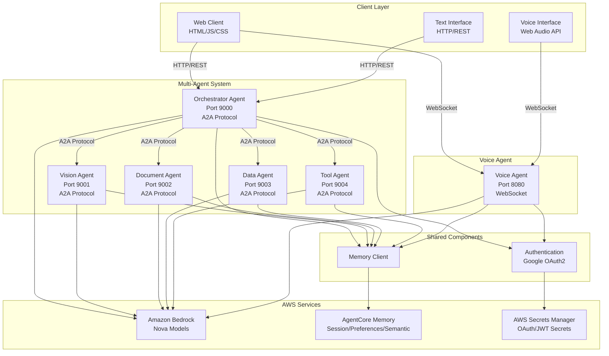
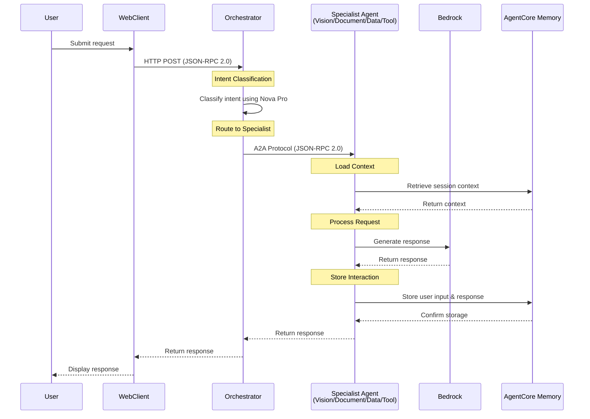
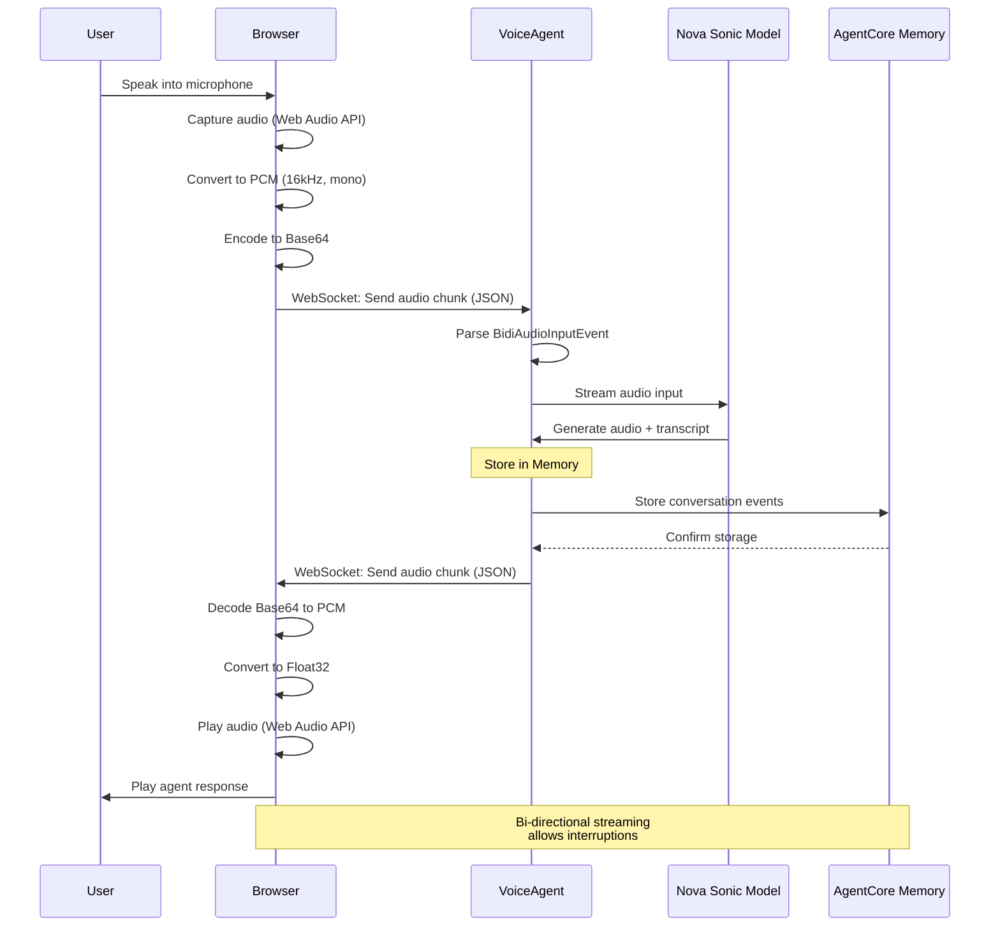
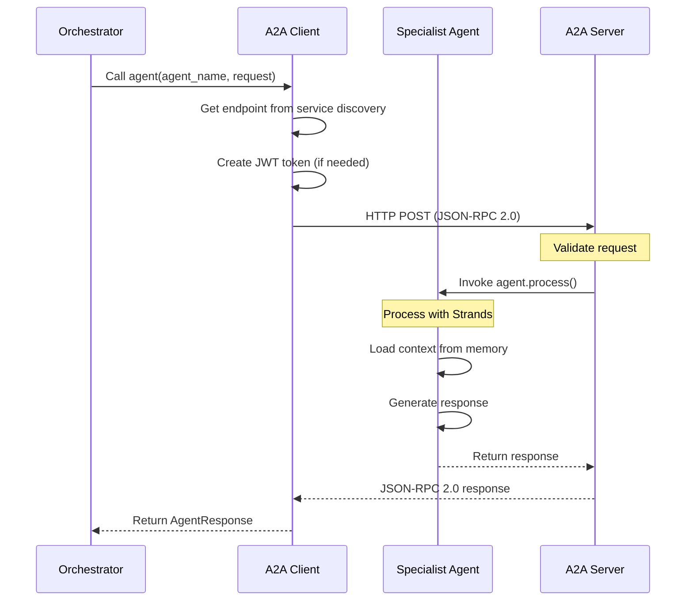
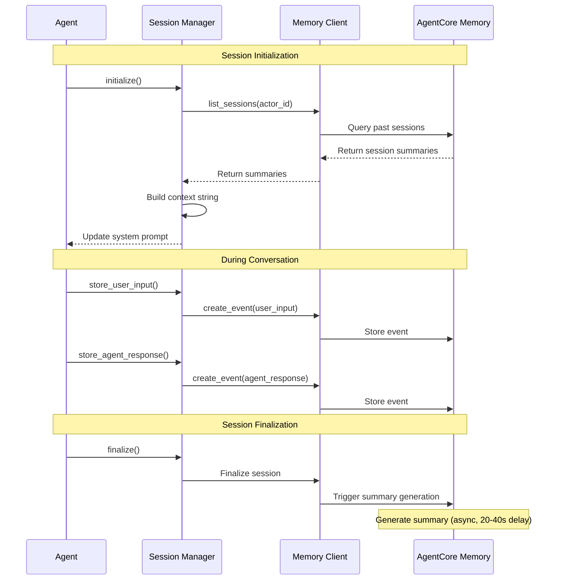
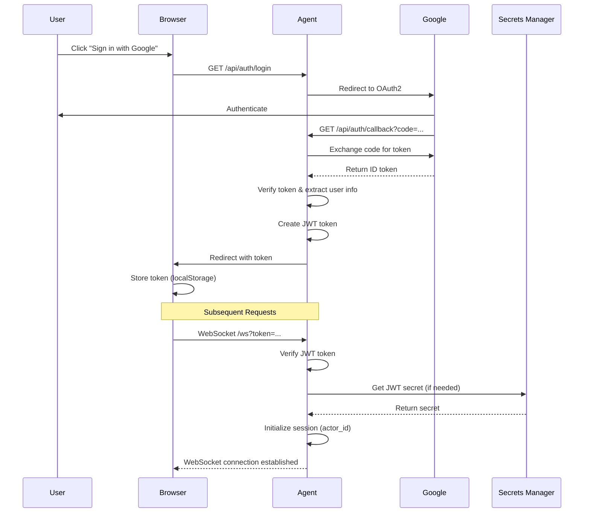
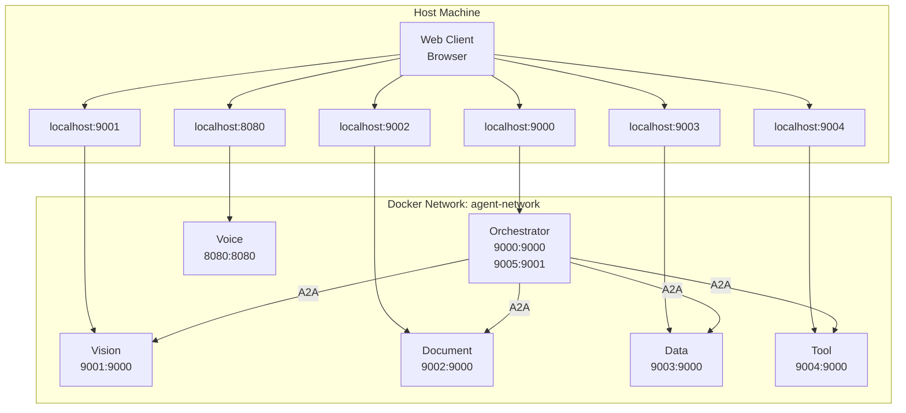
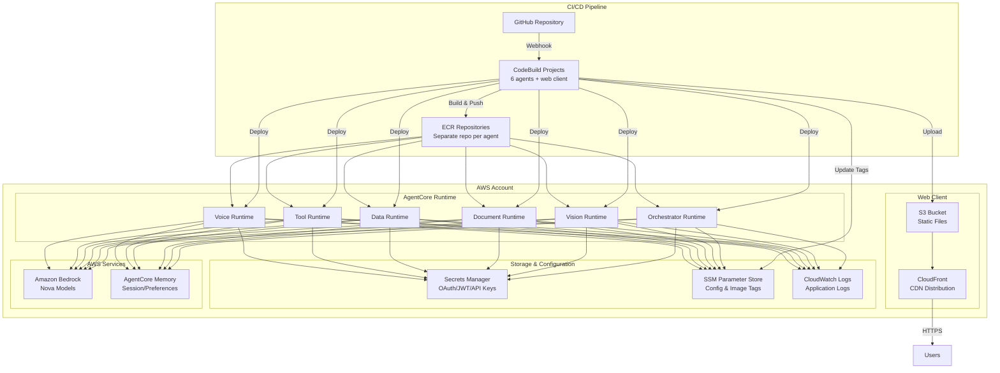
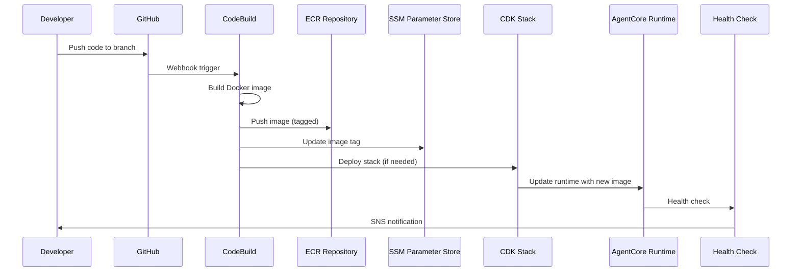

# AgentCore Voice Agent - Multi-Agent System

A production-ready multi-agent system with bi-directional voice streaming, text-based agent orchestration, and AgentCore Memory integration. Built with AWS Bedrock AgentCore Runtime, Strands framework, and Amazon Nova models.

## Table of Contents

- [Project Overview](#project-overview)
- [System Architecture](#system-architecture)
- [Quick Start](#quick-start)
- [Detailed Architecture](#detailed-architecture)
- [Development Guide](#development-guide)
- [Deployment](#deployment)
- [API Reference](#api-reference)
- [Troubleshooting](#troubleshooting)
- [Contributing](#contributing)

---

## Project Overview

### What is AgentCore Voice Agent?

AgentCore Voice Agent is a comprehensive multi-agent system that provides:

- **Bi-directional Voice Streaming**: Real-time voice conversations using Amazon Nova Sonic
- **Multi-Agent Orchestration**: Intelligent routing to specialist agents (vision, document, data, tool)
- **Persistent Memory**: AgentCore Memory integration for conversation continuity
- **Multimodal Support**: Image, video, and document processing capabilities
- **Production-Ready**: Docker containerization, AWS CDK infrastructure, comprehensive testing

### Key Features

- ✅ **6 Specialized Agents**: Orchestrator, Vision, Document, Data, Tool, and Voice
- ✅ **A2A Protocol**: Industry-standard agent-to-agent communication
- ✅ **WebSocket Streaming**: Real-time bi-directional audio streaming
- ✅ **Memory Integration**: Session summaries, user preferences, semantic memory
- ✅ **Google OAuth2**: Secure user authentication
- ✅ **Multimodal Content**: Image and video analysis
- ✅ **Tool Integration**: Calculator, weather API, database queries
- ✅ **Docker Compose**: Local development environment
- ✅ **AWS CDK**: Infrastructure as code for production deployment
- ✅ **CodeBuild Pipelines**: Automated CI/CD with GitHub integration
- ✅ **Separate ECR Repositories**: Independent versioning per agent
- ✅ **S3 + CloudFront**: Web client deployment
- ✅ **Automated Deployments**: No manual commands required

### Architecture at a Glance

The system consists of two main communication patterns:

1. **Text-Based Multi-Agent System**: Orchestrator routes requests to specialist agents via A2A protocol
2. **Voice Agent**: Standalone bi-directional streaming agent for real-time voice conversations

Both systems share AgentCore Memory for persistent context and user preferences.

### Technology Stack

- **Framework**: Strands (AWS SDK for AI agents)
- **Protocols**: A2A (JSON-RPC 2.0) for text agents, WebSocket for voice
- **Models**: Amazon Nova (Pro, Lite, Canvas, Sonic)
- **Memory**: AgentCore Memory (AWS Bedrock)
- **Backend**: FastAPI, Uvicorn
- **Frontend**: Vanilla JavaScript, Web Audio API (will support React)
- **Infrastructure**: Docker Compose (local), AWS CDK + CodeBuild (production)
- **CI/CD**: CodeBuild pipelines with GitHub webhooks
- **Container Registry**: AWS ECR (separate repos per agent)
- **Web Hosting**: S3 + CloudFront
- **Authentication**: Google OAuth2, JWT tokens
- **Configuration**: SSM Parameter Store + Secrets Manager (production)

### Production Infrastructure

The production deployment uses a fully automated CI/CD pipeline:

- **CodeBuild Pipelines**: Automated Docker builds triggered by GitHub pushes
- **ECR Repositories**: Separate repository per agent for independent versioning
- **AgentCore Runtime**: Managed container runtime for all agents
- **S3 + CloudFront**: Web client hosting with global CDN
- **SSM Parameter Store**: Non-sensitive configuration management
- **Secrets Manager**: Secure storage for OAuth, JWT, and API keys
- **Automated Deployments**: No manual commands required

See [docs/INFRASTRUCTURE.md](./docs/INFRASTRUCTURE.md) for detailed architecture.

---

## System Architecture

### High-Level Architecture



### Agent Descriptions

#### Orchestrator Agent
- **Port**: 9000 (HTTP REST), 9005 (A2A server)
- **Model**: Amazon Nova Pro (`us.amazon.nova-pro-v1:0`)
- **Purpose**: Routes user requests to appropriate specialist agents
- **Capabilities**: Intent classification, request routing, response synthesis
- **Protocol**: A2A (JSON-RPC 2.0)

#### Vision Agent
- **Port**: 9001
- **Model**: Amazon Nova Pro (`us.amazon.nova-pro-v1:0`)
- **Purpose**: Image and video analysis, visual content understanding
- **Capabilities**: Object detection, scene analysis, OCR, multimodal content processing
- **Protocol**: A2A (JSON-RPC 2.0)

#### Document Agent
- **Port**: 9002
- **Model**: Amazon Nova Pro (`us.amazon.nova-pro-v1:0`)
- **Purpose**: Document processing and text extraction
- **Capabilities**: PDF analysis, text extraction, document summarization
- **Protocol**: A2A (JSON-RPC 2.0)

#### Data Agent
- **Port**: 9003
- **Model**: Amazon Nova Lite (`us.amazon.nova-lite-v1:0`)
- **Purpose**: Data analysis and SQL queries
- **Capabilities**: SQL query generation, data visualization, statistical analysis
- **Protocol**: A2A (JSON-RPC 2.0)

#### Tool Agent
- **Port**: 9004
- **Model**: Amazon Nova Lite (`us.amazon.nova-lite-v1:0`)
- **Purpose**: Calculator, weather, and general utilities
- **Capabilities**: Mathematical calculations, weather API integration, database queries
- **Protocol**: A2A (JSON-RPC 2.0)
- **Tools**: Calculator, Weather API, Database Query

#### Voice Agent
- **Port**: 8080
- **Model**: Amazon Nova 2 Sonic (`amazon.nova-2-sonic-v1:0`)
- **Purpose**: Bi-directional voice streaming
- **Capabilities**: Real-time speech-to-speech, voice interruptions, audio streaming
- **Protocol**: WebSocket (bi-directional)
- **Note**: Independent from multi-agent orchestration system

### Communication Protocols

#### A2A Protocol (Text Agents)
- **Transport**: JSON-RPC 2.0 over HTTP
- **Port**: 9000 (standard A2A port)
- **Discovery**: Agent Cards at `/.well-known/agent-card.json`
- **Authentication**: Docker network isolation (local), IAM (production)
- **Format**: JSON-RPC 2.0 request/response

#### WebSocket Protocol (Voice Agent)
- **Transport**: WebSocket (WS/WSS)
- **Port**: 8080
- **Format**: JSON messages with base64-encoded audio
- **Audio**: 16kHz PCM input, 24kHz PCM output
- **Features**: Bi-directional streaming, real-time transcription

---

## Quick Start

> **Note**: This section covers **local development only**. For production deployment, see [Deployment](#deployment) section and [docs/DEPLOYMENT.md](./docs/DEPLOYMENT.md).

### Prerequisites

- **Python**: 3.10+ (3.11 for multi-agent system, 3.12 for voice agent)
- **Docker**: Docker and Docker Compose installed
- **AWS Account**: With Bedrock access configured (for local development)
- **AWS CLI**: Configured with credentials
- **PortAudio**: Required for voice agent (macOS: `brew install portaudio`)

### Environment Configuration

Create a `.env` file in the project root. You can copy `env.example` as a starting point:

```bash
cp env.example .env
```

> **Note**: The `.env` file is for **local development only**. In production, environment variables are managed via SSM Parameter Store and Secrets Manager. See [docs/ENVIRONMENT_VARIABLES.md](./docs/ENVIRONMENT_VARIABLES.md) for details.

#### AWS Credentials for Local Development

**IMPORTANT**: If your AWS account requires MFA (Multi-Factor Authentication), you must generate temporary credentials using `fix_mfa.py` for each local development session. These credentials are valid for 12 hours and are required for all AWS API calls (Bedrock, AgentCore Memory, etc.) during local development.

1. **Run the MFA script** (will prompt for MFA code once):
   ```bash
   python scripts/fix_mfa.py
   ```

2. **Copy the export commands** from the script output and update your `.env` file with the generated credentials:
   ```bash
   AWS_ACCESS_KEY_ID=<from script output>
   AWS_SECRET_ACCESS_KEY=<from script output>
   AWS_SESSION_TOKEN=<from script output>
   AWS_DEFAULT_REGION=<from script output>
   AWS_ACCOUNT_ID=<from script output>
   # Comment out AWS_PROFILE when using session tokens
   # AWS_PROFILE=
   ```

3. **Note**: These credentials expire after 12 hours. When they expire, re-run `python scripts/fix_mfa.py` and update your `.env` file with the new credentials.

**Why this is needed**: Docker Compose containers run in non-interactive mode and cannot handle interactive MFA prompts. The `fix_mfa.py` script generates temporary session credentials that bypass MFA prompts and allow all AWS SDK calls (boto3) to work seamlessly.

Then edit `.env` with your configuration. Here's a complete example with all available options:

```bash
# =============================================================================
# AWS Configuration
# =============================================================================
# Used by: docker-compose.yml, boto3 clients throughout codebase
# IMPORTANT: If using MFA, run 'python scripts/fix_mfa.py' and update these
# credentials for each local development session (valid for 12 hours)
AWS_REGION=us-west-2
AWS_PROFILE=default  # Optional: for named profiles (comment out when using session tokens)
AWS_ACCESS_KEY_ID=  # Required: from fix_mfa.py output if using MFA
AWS_SECRET_ACCESS_KEY=  # Required: from fix_mfa.py output if using MFA
AWS_SESSION_TOKEN=  # Required: from fix_mfa.py output if using MFA (temporary credentials)
AWS_DEFAULT_REGION=us-west-2
AWS_ACCOUNT_ID=  # Optional: used by scripts/fix_mfa.py, also from fix_mfa.py output

# =============================================================================
# Model Configuration
# =============================================================================
# Used by: agents/orchestrator/agent.py
ORCHESTRATOR_MODEL=us.amazon.nova-pro-v1:0

# Used by: agents/vision/agent.py
VISION_MODEL=us.amazon.nova-pro-v1:0

# Used by: agents/document/agent.py
DOCUMENT_MODEL=us.amazon.nova-pro-v1:0

# Used by: agents/data/agent.py
DATA_MODEL=us.amazon.nova-lite-v1:0

# Used by: agents/tool/agent.py
TOOL_MODEL=us.amazon.nova-lite-v1:0

# Used by: src/agent.py, agents/voice/app.py
MODEL_ID=amazon.nova-2-sonic-v1:0

# =============================================================================
# Voice Agent Configuration
# =============================================================================
# Used by: src/agent.py, agents/voice/app.py
VOICE=matthew
INPUT_SAMPLE_RATE=16000
OUTPUT_SAMPLE_RATE=24000
SYSTEM_PROMPT=You are a helpful voice assistant with access to calculator, weather, and database tools.

# =============================================================================
# AgentCore Memory Configuration
# =============================================================================
# Note: AgentCore Memory uses AWS SDK, not HTTP endpoint or API key
# It uses AWS credentials (AWS_PROFILE or IAM role)
#
# Used by: src/agent.py, agents/voice/app.py, agents/orchestrator/app.py
MEMORY_ENABLED=true

# Used by: src/memory/client.py, docker-compose.yml
AGENTCORE_MEMORY_ID=your-memory-id-here

# Used by: scripts/manage_memory.py
AGENTCORE_MEMORY_ARN=  # Optional: full ARN of memory resource

# Used by: src/memory/client.py, docker-compose.yml, infrastructure/cdk/app.py
AGENTCORE_MEMORY_REGION=us-west-2

# Used by: src/memory/session_manager.py
PAST_SESSIONS_COUNT=3  # Number of past sessions to load for context

# =============================================================================
# Agent Authentication (A2A Protocol)
# =============================================================================
# Used by: agents/shared/auth.py
# Note: All agents (orchestrator, vision, document, data, tool) must use the same value
# Generate using:
#   openssl rand -hex 32
AGENT_AUTH_SECRET=your-generated-secret-key

# =============================================================================
# Google OAuth2 Configuration
# =============================================================================
# Used by: src/auth/google_oauth2.py
# Optional: for user authentication
GOOGLE_CLIENT_ID=your-client-id.apps.googleusercontent.com
GOOGLE_CLIENT_SECRET=your-client-secret
GOOGLE_REDIRECT_URI=http://localhost:9000/api/auth/callback
GOOGLE_WORKSPACE_DOMAIN=  # Optional: restrict to specific domain

# =============================================================================
# Client JWT Configuration
# =============================================================================
# Used by: src/auth/google_oauth2.py
# Generate using:
#   openssl rand -hex 32
# Note: Must be at least 32 characters long for security
JWT_SECRET_KEY=your-generated-secret-key
JWT_ALGORITHM=HS256
JWT_EXPIRATION_MINUTES=60

# =============================================================================
# External APIs
# =============================================================================
# Used by: agents/tool/tools/weather.py
WEATHER_API_KEY=your-weather-api-key  # Optional: for weather tool

# =============================================================================
# Testing Configuration
# =============================================================================
# Used by: tests/integration/test_a2a_communication.py, tests/integration/test_multi_agent.py
# JWT token for integration tests to authenticate with orchestrator endpoints
# 
# To generate TEST_AUTH_TOKEN (choose one method):
#
# Method 1 - Via OAuth2 (recommended for production-like testing):
#   1. Start the orchestrator: docker-compose up orchestrator
#   2. Authenticate via OAuth2: curl http://localhost:9000/api/auth/login
#   3. Complete OAuth2 flow and extract the JWT token from the redirect URL
# 
# Method 2 - Generate programmatically using JWT_SECRET_KEY:
#   export JWT_SECRET_KEY=$(openssl rand -hex 32)
#   python3 -c "import jwt; import os; from datetime import datetime, timedelta; \
#     secret = os.getenv('JWT_SECRET_KEY'); \
#     token = jwt.encode({'sub': 'test-user', 'email': 'test@example.com', \
#     'exp': datetime.utcnow() + timedelta(hours=1), 'iat': datetime.utcnow()}, \
#     secret, algorithm='HS256'); print(token)"
#
# Method 3 - Simple test token (only for local development):
#   python3 -c "import jwt; from datetime import datetime, timedelta; \
#     token = jwt.encode({'sub': 'test-user', 'email': 'test@example.com', \
#     'exp': datetime.utcnow() + timedelta(hours=1), 'iat': datetime.utcnow()}, \
#     'test-secret-key-for-testing-only', algorithm='HS256'); print(token)"
TEST_AUTH_TOKEN=  # Optional: only needed for integration tests

# =============================================================================
# Advanced Configuration (Optional - defaults provided in code)
# =============================================================================
# Used by: agents/shared/service_discovery.py, docker-compose.yml
ENVIRONMENT=development

# Used by: agents/orchestrator/app.py, src/routes/vision.py
S3_VISION_BUCKET=agentcore-vision-uploads
S3_UPLOAD_PREFIX=uploads/
VISION_PRESIGNED_URL_EXPIRY=3600

# Used by: agents/orchestrator/app.py
A2A_PORT=9001
ORCHESTRATOR_HTTP_PORT=9000

# Used by: src/routes/vision.py
ORCHESTRATOR_BASE=http://localhost:9000

# Used by: agents/vision/agent.py
BEDROCK_MAX_TOKENS=4096
```

**Note**: See `env-example.txt` for a template with all available environment variables and their file references.

### Local Setup with Docker Compose

1. **Clone the repository**:
   ```bash
   git clone <repository-url>
   cd agentcore-voice-agent
   ```

2. **Create `.env` file** (see above)

3. **Start all agents**:
   ```bash
   docker-compose up --build
   ```

   This starts:
   - Orchestrator on port 9000
   - Vision agent on port 9001
   - Document agent on port 9002
   - Data agent on port 9003
   - Tool agent on port 9004
   - Voice agent on port 8080

4. **Verify agents are running**:
   ```bash
   # Check orchestrator
   curl http://localhost:9000/.well-known/agent-card.json | jq
   
   # Check vision agent
   curl http://localhost:9001/.well-known/agent-card.json | jq
   
   # Check voice agent
   curl http://localhost:8080/ping
   ```

5. **Open web client**:
   - Navigate to `http://localhost:8080` in your browser
   - The web client supports both voice and text modes

### Testing the System

#### Test Text-Based Multi-Agent System

```bash
# Test orchestrator routing to vision agent
curl -X POST http://localhost:9000 \
  -H "Content-Type: application/json" \
  -d '{
    "jsonrpc": "2.0",
    "method": "task",
    "params": {
      "task": "Analyze this image of a sunset",
      "user_id": "test-user",
      "session_id": "test-session"
    },
    "id": 1
  }' | jq

# Test tool agent directly
curl -X POST http://localhost:9004 \
  -H "Content-Type: application/json" \
  -d '{
    "jsonrpc": "2.0",
    "method": "task",
    "params": {
      "task": "What is 15% of 200?",
      "user_id": "test-user",
      "session_id": "test-session"
    },
    "id": 1
  }' | jq
```

#### Test Voice Agent

1. Open `http://localhost:8080` in your browser
2. Click "Connect" to establish WebSocket connection
3. Click "Start Recording" to begin voice conversation
4. Speak into your microphone
5. Agent responses will be played through speakers

### Running Individual Agents

#### Voice Agent Only

```bash
# From project root
python src/agent.py
```

#### Multi-Agent System (without voice)

```bash
# Start orchestrator and specialist agents
docker-compose up orchestrator vision document data tool
```

#### All Agents

```bash
docker-compose up
```

---

## Detailed Architecture

### Multi-Agent Communication Flow



### Voice Agent Streaming Flow



### A2A Protocol Sequence



### Memory Integration Flow



### Authentication Flow



### Docker Compose Network Topology



### AWS Infrastructure Architecture



### CI/CD Pipeline Flow



### Memory Strategies

The system uses three AgentCore Memory strategies:

1. **Session Summarizer** (`/summaries/{actorId}/{sessionId}`)
   - Captures conversation summaries
   - Generated asynchronously after session ends (20-40 second delay)
   - Used for context in future sessions

2. **User Preferences** (`/preferences/{actorId}`)
   - Stores user preferences and behavior patterns
   - Persists across sessions
   - Enables personalized responses

3. **Semantic Memory** (`/semantic/{actorId}`)
   - Vector embeddings for factual information
   - Enables semantic search for relevant memories
   - Supports context retrieval based on query similarity

---

## Development Guide

### Project Structure

```
agentcore-voice-agent/
├── agents/                    # Multi-agent system
│   ├── orchestrator/          # Orchestrator agent
│   │   ├── app.py            # FastAPI + A2A server
│   │   ├── agent.py          # Orchestrator logic
│   │   ├── a2a_client.py     # A2A communication client
│   │   ├── Dockerfile
│   │   └── requirements.txt
│   ├── vision/                # Vision agent
│   │   ├── app.py            # A2A server
│   │   ├── agent.py          # Vision processing logic
│   │   ├── Dockerfile
│   │   └── requirements.txt
│   ├── document/              # Document agent
│   ├── data/                  # Data agent
│   ├── tool/                  # Tool agent
│   │   └── tools/            # Tool implementations
│   │       ├── calculator.py
│   │       ├── weather.py
│   │       └── database.py
│   ├── voice/                 # Voice agent (standalone)
│   │   ├── app.py            # WebSocket server
│   │   ├── Dockerfile
│   │   └── requirements.txt
│   └── shared/                # Shared components
│       ├── models.py         # Pydantic models
│       ├── memory_client.py   # Memory client
│       ├── auth.py           # Inter-agent auth
│       ├── observability.py  # Logging/metrics
│       ├── circuit_breaker.py
│       └── retry.py
├── src/                       # Legacy/voice agent source
│   ├── agent.py              # Voice agent implementation
│   ├── memory/               # Memory client
│   ├── auth/                 # OAuth2 authentication
│   ├── tools/                # Tools (calculator, weather, database)
│   └── config/               # Configuration
├── client/                    # Web client
│   └── web/
│       ├── index.html        # Main HTML
│       └── app.js            # JavaScript application
├── infrastructure/           # AWS CDK infrastructure
│   └── cdk/
│       ├── app.py            # CDK app entry point
│       ├── agentcore_stack.py        # Base infrastructure (ECR, IAM, Secrets)
│       ├── agentcore_runtime_stack.py # Voice agent runtime
│       ├── multi_agent_stack.py      # Multi-agent system
│       ├── vision_stack.py           # Vision infrastructure
│       ├── codebuild_stack.py        # CodeBuild pipelines
│       ├── web_client_stack.py       # Web client (S3 + CloudFront)
│       └── deployment_stack.py      # Deployment orchestration
├── buildspecs/               # CodeBuild build specifications
│   ├── buildspec-orchestrator.yml
│   ├── buildspec-vision.yml
│   ├── buildspec-document.yml
│   ├── buildspec-data.yml
│   ├── buildspec-tool.yml
│   ├── buildspec-voice.yml
│   └── buildspec-web-client.yml
├── .github/                  # GitHub Actions workflows
│   └── workflows/
│       └── ci.yml            # CI pipeline for PRs
├── tests/                     # Test suite
│   ├── unit/                 # Unit tests
│   └── integration/          # Integration tests
├── scripts/                   # Utility scripts
│   ├── manage_memory.py     # Memory management
│   ├── fix_mfa.py           # MFA credential helper
│   └── darcy_memory.py       # Memory debugging
├── docs/                      # Documentation
├── docker-compose.yml        # Local development
└── requirements.txt          # Root dependencies
```

### Adding a New Agent

1. **Create agent directory**:
   ```bash
   mkdir -p agents/newagent
   ```

2. **Create agent implementation** (`agents/newagent/agent.py`):
   ```python
   from strands import Agent
   from agents.shared.models import AgentRequest, AgentResponse
   from agents.shared.memory_client import MemoryClient
   from agents.shared.observability import AgentLogger
   
   class NewAgent:
       def __init__(self):
           self.agent_name = "newagent"
           self.logger = AgentLogger(self.agent_name)
           self.memory = MemoryClient()
           self.strands_agent = Agent(
               model=os.getenv("NEWAGENT_MODEL", "amazon.nova-pro-v1:0"),
               system_prompt="Your system prompt here"
           )
       
       async def process(self, request: AgentRequest) -> AgentResponse:
           # Implementation
           pass
   ```

3. **Create A2A server** (`agents/newagent/app.py`):
   ```python
   from strands.multiagent.a2a import A2AServer
   from agents.newagent.agent import NewAgent
   
   agent = NewAgent()
   server = A2AServer(agent=agent, port=9000)
   server.start()
   ```

4. **Add to docker-compose.yml**:
   ```yaml
   newagent:
     build:
       context: .
       dockerfile: agents/newagent/Dockerfile
     ports:
       - "9006:9000"
     environment:
       - NEWAGENT_MODEL=${NEWAGENT_MODEL:-amazon.nova-pro-v1:0}
     networks:
       - agent-network
   ```

5. **Update orchestrator** to route to new agent

### Adding a New Tool

1. **Create tool file** (`agents/tool/tools/newtool.py`):
   ```python
   from strands.tools import tool
   
   @tool
   def new_tool(param1: str, param2: int) -> str:
       """Tool description for the agent."""
       # Implementation
       return result
   ```

2. **Import in agent** (`agents/tool/agent.py`):
   ```python
   from agents.tool.tools.newtool import new_tool
   
   self.strands_agent = Agent(
       model=model_id,
       tools=[calculator, weather_api, database_query, new_tool],
       system_prompt=self._get_system_prompt()
   )
   ```

### Testing Guidelines

#### Unit Tests

```bash
# Run all unit tests
pytest tests/unit/

# Run specific test file
pytest tests/unit/test_tools/test_calculator.py

# Run with coverage
pytest --cov=src --cov-report=html
```

#### Integration Tests

```bash
# Start agents first
docker-compose up -d

# Run integration tests
pytest tests/integration/

# Test A2A communication
pytest tests/integration/test_a2a_communication.py
```

#### Test Coverage Goals

- **Tools**: 90%+ coverage
- **Agent Components**: 80%+ coverage
- **Endpoints**: 90%+ coverage
- **Memory Modules**: 90%+ coverage

### Development Workflow

1. **Create feature branch**:
   ```bash
   git checkout -b feature/new-feature
   ```

2. **Make changes**:
   - Write code
   - Add tests
   - Update documentation

3. **Test locally**:
   ```bash
   docker-compose up --build
   pytest
   ```

4. **Commit and push**:
   ```bash
   git commit -m "Add new feature"
   git push origin feature/new-feature
   ```

---

## Deployment

### Overview

Production deployments are **fully automated** via CodeBuild pipelines triggered by GitHub pushes. No manual `agentcore configure` or `agentcore launch` commands are required.

**For detailed deployment instructions, see [docs/DEPLOYMENT.md](./docs/DEPLOYMENT.md)**

### Prerequisites

- AWS Account with Bedrock access
- AWS CLI configured
- CDK CLI installed: `npm install -g aws-cdk`
- GitHub repository with webhook access
- Python 3.11+ for CDK stacks

### Automated CI/CD Deployment

The system uses CodeBuild pipelines for automated deployments:

1. **Push to GitHub**: Code changes pushed to `main` (production) or `develop` (dev) branch
2. **CodeBuild Triggered**: GitHub webhook triggers CodeBuild project
3. **Build Docker Image**: Agent-specific image built and tagged with `{branch}-{commit-sha}`
4. **Push to ECR**: Image pushed to agent-specific ECR repository
5. **Update SSM**: Image tag stored in SSM Parameter Store
6. **Deploy CDK**: Infrastructure updated if needed
7. **Update Runtime**: AgentCore Runtime updated with new image
8. **Health Check**: Automated verification

### Initial Infrastructure Setup

See [docs/DEPLOYMENT.md](./docs/DEPLOYMENT.md) for complete initial setup instructions, including:

- CDK bootstrap
- Base infrastructure deployment
- ECR repository creation (separate repos per agent)
- Secrets Manager configuration
- SSM Parameter Store setup
- CodeBuild pipeline deployment
- GitHub webhook configuration

### Infrastructure Components

#### ECR Repository Structure

Each agent has its own ECR repository for independent versioning:

- `agentcore-voice-agent-orchestrator`
- `agentcore-voice-agent-vision`
- `agentcore-voice-agent-document`
- `agentcore-voice-agent-data`
- `agentcore-voice-agent-tool`
- `agentcore-voice-agent-voice`

#### CodeBuild Pipelines

Automated build projects for each component:
- One CodeBuild project per agent (6 total)
- One CodeBuild project for web client
- GitHub webhook integration
- Branch-based deployments (main → prod, develop → dev)

#### Web Client Deployment

- **S3 Bucket**: Hosts static web client files
- **CloudFront Distribution**: CDN for global delivery
- **Runtime Configuration**: API endpoints injected via `config.js`
- **Automatic Invalidation**: Cache cleared on deployment

#### Environment Configuration

Production uses:
- **SSM Parameter Store**: Non-sensitive configuration (model IDs, endpoints, etc.)
- **Secrets Manager**: Sensitive values (OAuth, JWT, API keys)
- **IAM Roles**: No access keys in production

See [docs/ENVIRONMENT_VARIABLES.md](./docs/ENVIRONMENT_VARIABLES.md) for complete variable reference.

### Manual Deployment (If Needed)

If automated deployment is not available, see [docs/DEPLOYMENT.md](./docs/DEPLOYMENT.md) for manual deployment procedures.

### Monitoring

- **CloudWatch Logs**: Application logs for each agent (`/aws/agentcore/voice-agent`)
- **CloudWatch Metrics**: Build success rates, deployment duration
- **CodeBuild Logs**: Detailed build and deployment logs
- **SNS Notifications**: Deployment success/failure notifications
- **Health Checks**: Automated post-deployment verification
- **AgentCore Runtime**: Built-in observability dashboard

### Rollback Procedures

See [docs/DEPLOYMENT.md](./docs/DEPLOYMENT.md) for detailed rollback procedures.

---

## API Reference

### Orchestrator Agent

#### Endpoints

- **HTTP REST API**: `http://localhost:9000`
- **A2A Server**: `http://localhost:9005` (internal)

#### JSON-RPC 2.0 Task Method

```json
POST http://localhost:9000
Content-Type: application/json

{
  "jsonrpc": "2.0",
  "method": "task",
  "params": {
    "task": "Analyze this image",
    "user_id": "user@example.com",
    "session_id": "session-uuid"
  },
  "id": 1
}
```

**Response**:
```json
{
  "jsonrpc": "2.0",
  "id": 1,
  "result": {
    "content": "The image shows...",
    "agent_name": "orchestrator",
    "metadata": {
      "specialist": "vision"
    }
  }
}
```

#### Agent Card

```bash
GET http://localhost:9000/.well-known/agent-card.json
```

### Specialist Agents (Vision, Document, Data, Tool)

All specialist agents follow the same A2A protocol:

#### Endpoints

- **Vision**: `http://localhost:9001`
- **Document**: `http://localhost:9002`
- **Data**: `http://localhost:9003`
- **Tool**: `http://localhost:9004`

#### JSON-RPC 2.0 Task Method

Same format as orchestrator, but agents process requests directly.

### Voice Agent

#### WebSocket Endpoint

```
ws://localhost:8080/ws?token=<jwt-token>
```

#### Message Types (Client → Server)

**Audio Input**:
```json
{
  "audio": "base64-encoded-pcm-data",
  "sample_rate": 16000,
  "format": "pcm",
  "channels": 1
}
```

**Text Input**:
```json
{
  "text": "Hello, how are you?",
  "input_type": "text"
}
```

#### Message Types (Server → Client)

**Audio Output**:
```json
{
  "type": "audio",
  "data": "base64-encoded-pcm-data",
  "format": "pcm",
  "sample_rate": 24000
}
```

**Transcript**:
```json
{
  "type": "transcript",
  "data": "Hello, I'm doing well!",
  "role": "assistant"
}
```

**Tool Use**:
```json
{
  "type": "tool_use",
  "tool": "calculator",
  "data": "15 * 20 = 300"
}
```

**Error**:
```json
{
  "type": "error",
  "message": "Error description"
}
```

#### HTTP Endpoints

- **Health Check**: `GET http://localhost:8080/ping`
- **OAuth Login**: `GET http://localhost:8080/api/auth/login`
- **OAuth Callback**: `GET http://localhost:8080/api/auth/callback`
- **User Info**: `GET http://localhost:8080/api/auth/me`

### A2A Protocol Specification

The A2A protocol uses JSON-RPC 2.0 over HTTP:

#### Request Format

```json
{
  "jsonrpc": "2.0",
  "method": "task",
  "params": {
    "task": "string",
    "user_id": "string",
    "session_id": "string"
  },
  "id": 1
}
```

#### Response Format

```json
{
  "jsonrpc": "2.0",
  "id": 1,
  "result": {
    "content": "string",
    "agent_name": "string",
    "metadata": {}
  }
}
```

#### Error Format

```json
{
  "jsonrpc": "2.0",
  "id": 1,
  "error": {
    "code": -32000,
    "message": "Error description"
  }
}
```

---

## Troubleshooting

### Common Issues

#### CodeBuild Pipeline Issues

**Symptoms**: Builds fail or don't trigger

**Solutions**:
1. **Check GitHub Webhook**: Verify webhook is configured and pointing to CodeBuild
2. **Verify IAM Permissions**: Ensure CodeBuild role has ECR push permissions
3. **Check Build Logs**: Review CodeBuild console for detailed error messages
4. **Verify Environment Variables**: Check CodeBuild project environment variables (GITHUB_OWNER, GITHUB_REPO)
5. **ECR Authentication**: Ensure CodeBuild can authenticate to ECR repositories

#### ECR Push Failures

**Symptoms**: Docker images fail to push to ECR

**Solutions**:
1. **Authentication**: Verify ECR login succeeded in build logs
2. **Permissions**: Check CodeBuild role has `ecr:BatchGetImage` and `ecr:PutImage` permissions
3. **Repository Exists**: Verify ECR repository was created in base stack
4. **Image Tag Format**: Ensure image tags follow `{branch}-{commit-sha}` format

#### CDK Deployment Issues

**Symptoms**: CDK stack deployment fails

**Solutions**:
1. **Stack Dependencies**: Ensure base stack is deployed before dependent stacks
2. **SSM Parameters**: Verify all required SSM parameters exist (check buildspec for parameter names)
3. **CloudFormation Events**: Review stack events in CloudFormation console for specific errors
4. **Image Tags**: Ensure image tags in SSM match images in ECR

#### Agents Won't Start

**Symptoms**: Docker containers fail to start or exit immediately (local development)

**Solutions**:
1. Check AWS credentials:
   ```bash
   aws sts get-caller-identity
   ```
   **Note**: If using MFA, ensure you've run `python scripts/fix_mfa.py` and updated your `.env` file with the generated credentials (valid for 12 hours).

2. Verify Docker is running:
   ```bash
   docker ps
   ```

3. Check logs:
   ```bash
   docker-compose logs orchestrator
   ```

4. Verify environment variables in `.env` file, especially AWS credentials if using MFA

#### A2A Communication Fails

**Symptoms**: Orchestrator cannot reach specialist agents

**Solutions**:
1. Verify all agents are running:
   ```bash
   docker-compose ps
   ```

2. Check network connectivity:
   ```bash
   docker-compose exec orchestrator curl http://vision:9000/.well-known/agent-card.json
   ```

3. Verify service names match in `docker-compose.yml`

4. Check A2A server is running on correct port (9001 internally)

#### Memory Not Working

**Symptoms**: Agents don't retrieve or store conversation context

**Solutions**:
1. Verify `AGENTCORE_MEMORY_ID` is set:
   ```bash
   echo $AGENTCORE_MEMORY_ID
   ```

2. Check memory exists:
   ```bash
   python scripts/manage_memory.py status
   ```

3. Verify AWS credentials have permissions:
   ```bash
   aws bedrock-agentcore get-memory --memory-id $AGENTCORE_MEMORY_ID
   ```

4. Check memory region matches:
   - `AGENTCORE_MEMORY_REGION` should match memory creation region

#### Voice Agent Audio Issues

**Symptoms**: No audio input/output, microphone not working

**Solutions**:
1. Check browser permissions for microphone access
2. Verify PortAudio is installed (macOS: `brew install portaudio`)
3. Check browser console for Web Audio API errors
4. Verify WebSocket connection is established
5. Check sample rate configuration (16kHz input, 24kHz output)

#### Environment Variable Resolution

**Symptoms**: SSM parameter not found, secrets access denied

**Solutions**:
1. **SSM Parameter Missing**: Create parameter:
   ```bash
   aws ssm put-parameter \
     --name "/agentcore/voice-agent/{env}/parameter-name" \
     --value "value" \
     --type "String"
   ```

2. **Secrets Access Denied**: Verify IAM role has `secretsmanager:GetSecretValue` permission

3. **Wrong Environment**: Check `ENVIRONMENT` context matches SSM path (`dev` vs `prod`)

4. **Local Development**: Ensure `.env` file exists and has required variables

#### Web Client Deployment Issues

**Symptoms**: CloudFront cache issues, S3 upload failures

**Solutions**:
1. **S3 Upload Failure**: Check CodeBuild role has `s3:PutObject` permission
2. **CloudFront Invalidation**: Verify distribution ID is correct in CodeBuild environment variables
3. **Cache Not Clearing**: Wait for invalidation to complete (usually 1-2 minutes)
4. **Config.js Missing**: Verify SSM parameters for API endpoints exist

#### Agent Deployment Issues

**Symptoms**: AgentCore Runtime update failures, health check issues

**Solutions**:
1. **Image Not Found**: Verify image exists in ECR with specified tag
2. **Runtime Status**: Check runtime is in active state before update
3. **Health Check Endpoint**: Verify `/ping` or `/.well-known/agent-card.json` endpoints respond
4. **Runtime Logs**: Review CloudWatch logs for runtime errors

#### Authentication Errors

**Symptoms**: OAuth2 login fails, JWT verification errors

**Solutions**:
1. Verify Google OAuth2 credentials:
   - **Local**: Check `GOOGLE_CLIENT_ID` and `GOOGLE_CLIENT_SECRET` in `.env`
   - **Production**: Verify secret in Secrets Manager: `agentcore/voice-agent/{env}/google-oauth2`
   - Verify redirect URI matches Google Cloud Console

2. Check JWT secret:
   - **Local**: `echo $JWT_SECRET_KEY`
   - **Production**: Verify secret in Secrets Manager: `agentcore/voice-agent/{env}/jwt-secret`

3. Verify token expiration:
   - Default: 60 minutes
   - Check `JWT_EXPIRATION_MINUTES` setting

4. Check Google Workspace domain restriction (if enabled)

### Debugging Tips

#### Enable Verbose Logging

Set log level in agent code:
```python
import logging
logging.basicConfig(level=logging.DEBUG)
```

#### Check Agent Logs

```bash
# View all logs
docker-compose logs -f

# View specific agent
docker-compose logs -f orchestrator

# View last 100 lines
docker-compose logs --tail=100 orchestrator
```

#### Test A2A Communication

```bash
# Test orchestrator agent card
curl http://localhost:9000/.well-known/agent-card.json | jq

# Test vision agent directly
curl -X POST http://localhost:9001 \
  -H "Content-Type: application/json" \
  -d '{
    "jsonrpc": "2.0",
    "method": "task",
    "params": {
      "task": "Test message",
      "user_id": "test",
      "session_id": "test"
    },
    "id": 1
  }' | jq
```

#### Memory Debugging

```bash
# Check memory status
python scripts/manage_memory.py status

# Query specific session
python scripts/manage_memory.py query-session \
  --actor-id "user@example.com" \
  --session-id "session-uuid"

# List all namespaces
python scripts/manage_memory.py list-namespaces \
  --actor-id "user@example.com"

# Debug memory records
python scripts/manage_memory.py debug-memory \
  --actor-id "user@example.com"
```

### Log Analysis

#### Common Log Patterns

**Successful A2A Call**:
```
INFO: A2A call - source_agent=orchestrator target_agent=vision latency_ms=1234.56 success=True
```

**Memory Storage**:
```
INFO: Storing interaction - user_id=user@example.com session_id=uuid agent_name=vision
```

**Authentication**:
```
INFO: User authenticated - email=user@example.com
```

#### Error Patterns

**A2A Communication Error**:
```
ERROR: A2A call failed - target_agent=vision error=Connection refused
```

**Memory Error**:
```
ERROR: Memory operation failed - operation=create_event error=AccessDenied
```

**Authentication Error**:
```
ERROR: JWT verification failed - error=Invalid token
```

---

## Contributing

### Development Workflow

1. Fork the repository
2. Create a feature branch: `git checkout -b feature/new-feature`
3. Make changes and add tests
4. Run tests: `pytest`
5. Commit changes: `git commit -m "Add new feature"`
6. Push to branch: `git push origin feature/new-feature`
7. Create pull request

### Code Style

- Follow PEP 8 for Python code
- Use type hints where possible
- Add docstrings to all functions and classes
- Keep functions focused and small

### Testing Requirements

- All new features must include tests
- Maintain or improve test coverage
- Integration tests for new agents or tools
- Update documentation for API changes

### Documentation

- Update README for user-facing changes
- Add docstrings to new code
- Update architecture diagrams if structure changes
- Document new environment variables

---

## Additional Resources

### Documentation

- [Deployment Guide](./docs/DEPLOYMENT.md) - **Production deployment instructions**
- [Environment Variables](./docs/ENVIRONMENT_VARIABLES.md) - **Complete variable reference**
- [Infrastructure Architecture](./docs/INFRASTRUCTURE.md) - **Infrastructure details**
- [Template Update Guide](./docs/UPDATE_GUIDE.md) - **How to pull upstream template updates**
- [Bi-Directional Architecture](./docs/BIDI_ARCHITECTURE.md) - Voice agent architecture details
- [Quick Start Guide](./docs/QUICKSTART.md) - Detailed setup instructions
- [Docker Compose Guide](./docs/DOCKER_COMPOSE.md) - Local development setup
- [A2A Migration Guide](./docs/agentcore_a2a_migration_guide__strands___cdk_.md) - A2A protocol details
- [CDK Infrastructure](./infrastructure/cdk/README.md) - CDK stack details
- [Testing Guide](./tests/README.md) - Test documentation

### External Resources

- [Strands Framework Documentation](https://strandsagents.com/)
- [A2A Protocol Specification](https://a2a-protocol.org/)
- [AgentCore Runtime Documentation](https://docs.aws.amazon.com/bedrock/latest/userguide/agentcore-runtime.html)
- [Amazon Bedrock Documentation](https://docs.aws.amazon.com/bedrock/)
- [AgentCore Memory Documentation](https://docs.aws.amazon.com/bedrock/latest/userguide/agentcore-memory.html)

### Support

For issues or questions:
- Check logs: `docker-compose logs -f`
- Review troubleshooting section
- Check existing documentation
- Open an issue on GitHub

---

## License

Apache 2.0
