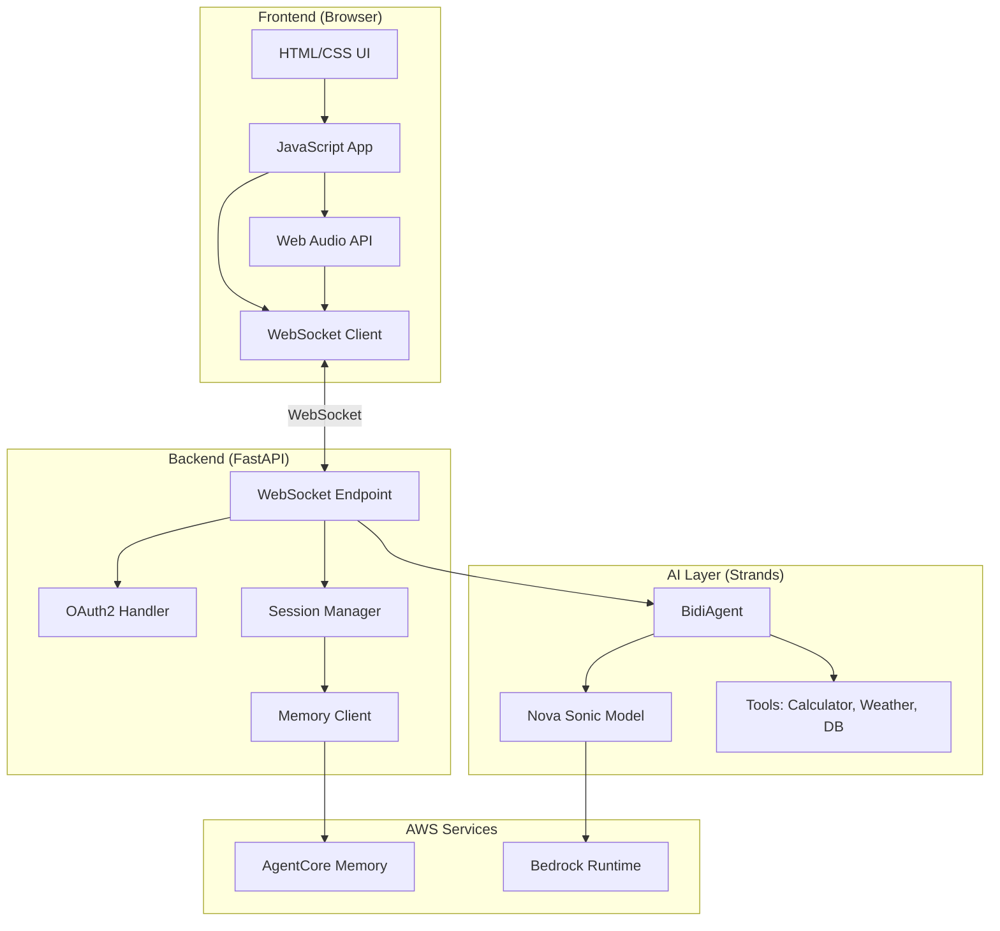
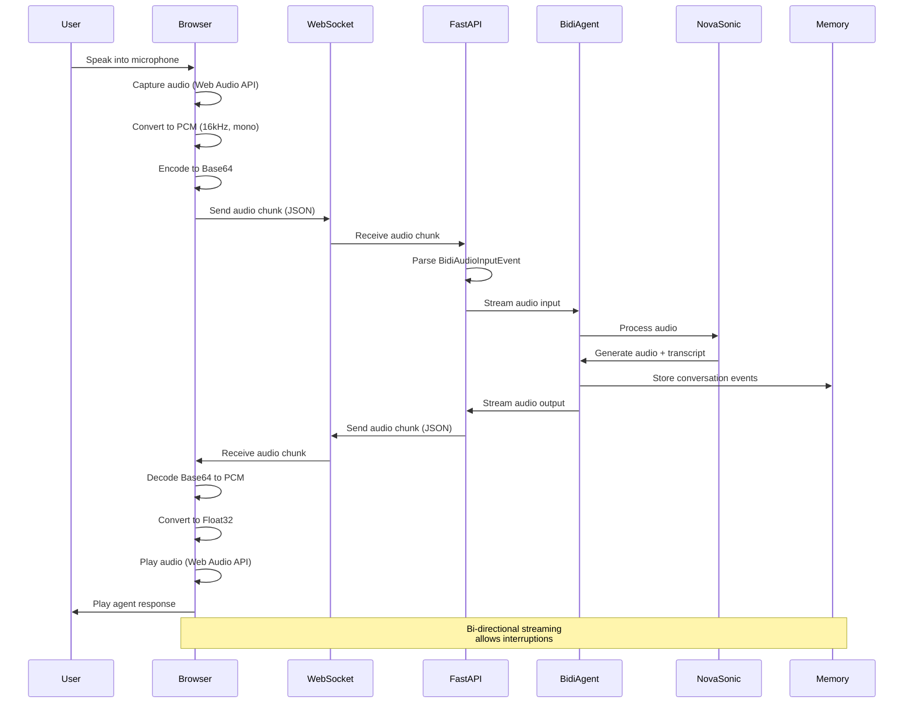
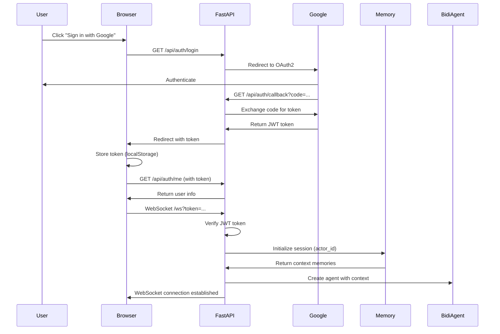
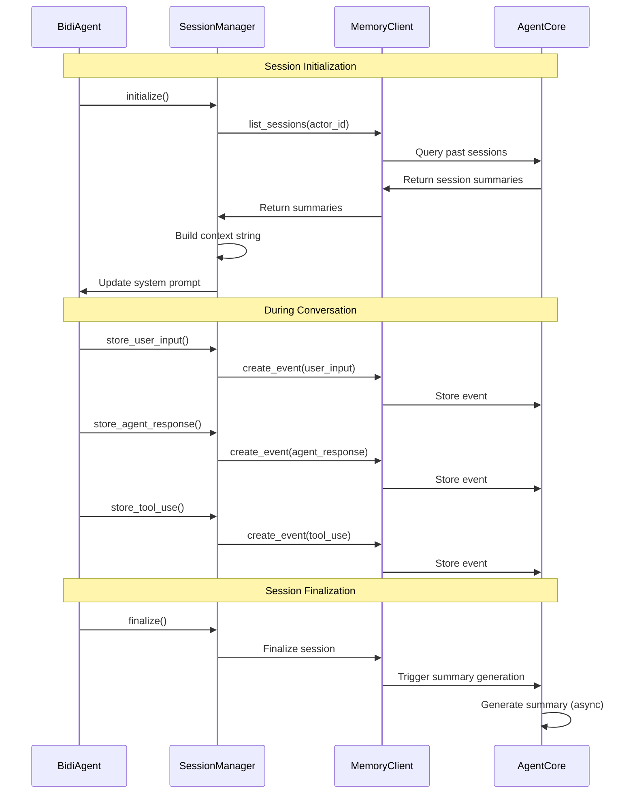

# Bi-Directional Streaming Voice Agent Architecture

This document describes the architecture and technologies used to implement a bi-directional, streaming voice API using AgentCore and Strands.

## Overview

The system enables real-time voice conversations between users and an AI agent powered by Amazon Nova Sonic. The architecture supports:
- **Bi-directional audio streaming** - simultaneous input and output
- **Real-time transcription** - both user and agent speech
- **Context-aware responses** - using AgentCore Memory for persistent memory
- **Tool integration** - calculator, weather, and database tools
- **Authentication** - Google OAuth2 for user identification

## Technology Stack

### Frontend Technologies

#### Core Web APIs
- **WebSocket API** - Bi-directional real-time communication with the backend
- **Web Audio API** - Audio capture, processing, and playback
  - `AudioContext` - Audio processing context
  - `ScriptProcessorNode` - Real-time audio chunk processing
  - `MediaStreamSource` - Microphone input source
  - `BufferSource` - Audio playback
- **MediaDevices API** - Microphone access
  - `getUserMedia()` - Request microphone permissions
- **Fetch API** - REST API calls for authentication and memory queries

#### Frontend Implementation
- **Vanilla JavaScript** - No framework dependencies
- **HTML5/CSS3** - UI rendering and styling
- **Base64 Encoding** - Audio data serialization for WebSocket transmission

#### Audio Processing Pipeline
1. **Capture**: Microphone → `MediaStream` → `AudioContext`
2. **Conversion**: Float32 PCM → Int16 PCM (16-bit linear PCM required by Nova Sonic)
3. **Encoding**: Int16Array → Base64 string
4. **Transmission**: Base64 string → WebSocket JSON message
5. **Playback**: Base64 string → Int16Array → Float32Array → AudioBuffer → Speakers

### Backend Technologies

#### Core Framework
- **FastAPI** - Modern Python web framework with async support
- **Uvicorn** - ASGI server for running FastAPI
- **WebSockets** - FastAPI WebSocket support for real-time communication

#### AI/ML Stack
- **Strands** - Agent framework for building conversational AI
  - `BidiAgent` - Bi-directional streaming agent
  - `BidiNovaSonicModel` - Amazon Nova Sonic voice model integration
  - `BidiInput` / `BidiOutput` - Streaming I/O interfaces
- **Amazon Nova Sonic** - Voice model for speech-to-speech conversations
  - Input: 16kHz Linear PCM audio
  - Output: 24kHz Linear PCM audio
  - Supports interruptions and real-time streaming

#### Memory & Persistence
- **AgentCore Memory** - AWS Bedrock AgentCore Memory service
  - Session summaries
  - User preferences
  - Semantic memory (vector embeddings)
- **MemoryClient** - Python SDK for AgentCore Memory
- **MemorySessionManager** - Session lifecycle and context management

#### Authentication
- **Google OAuth2** - User authentication
  - `google-auth` - Google authentication library
  - `google-auth-oauthlib` - OAuth2 flow
  - `PyJWT` - JWT token verification

#### AWS Integration
- **Boto3** - AWS SDK for Python
- **Bedrock Runtime** - Amazon Bedrock API client

#### Custom Tools
- **Calculator** - Mathematical operations
- **Weather API** - Weather information retrieval
- **Database Query** - Database operations

## System Architecture

### High-Level Architecture

### Bi-Directional Streaming Flow

### Authentication & Session Flow

### Memory Integration Flow

## Data Flow Details

### Audio Input Pipeline

1. **Browser Capture**
   - `getUserMedia()` requests microphone access
   - Creates `AudioContext` at 16kHz sample rate
   - Creates `ScriptProcessorNode` with 4096 sample buffer (~256ms chunks)
   - Processes audio in real-time callback

2. **Audio Conversion**
   - Input: Float32Array (Web Audio API format, -1.0 to 1.0)
   - Conversion: Clamp to [-1, 1] range
   - Output: Int16Array (16-bit PCM, -32768 to 32767)
   - Formula: `pcm[i] = clamp(input[i]) * 0x7FFF`

3. **Encoding & Transmission**
   - Int16Array → ArrayBuffer → Base64 string
   - Wrapped in JSON: `{audio: base64, sample_rate: 16000, format: "pcm", channels: 1}`
   - Sent via WebSocket as text message

4. **Backend Processing**
   - FastAPI receives JSON message
   - Extracts base64 audio data
   - Creates `BidiAudioInputEvent` with audio, format, sample_rate
   - Streams to BidiAgent

5. **Agent Processing**
   - BidiAgent receives audio events
   - Streams to Nova Sonic model
   - Nova Sonic processes audio in real-time
   - Generates transcript and response audio

### Audio Output Pipeline

1. **Agent Generation**
   - Nova Sonic generates audio response (24kHz PCM)
   - Emits `BidiAudioStreamEvent` with base64 audio
   - BidiAgent streams events to WebSocketOutput

2. **Backend Transmission**
   - WebSocketOutput receives `BidiAudioStreamEvent`
   - Extracts audio, format, sample_rate
   - Wraps in JSON: `{type: "audio", data: base64, format: "pcm", sample_rate: 24000}`
   - Sends via WebSocket

3. **Browser Reception**
   - WebSocket receives JSON message
   - Extracts base64 audio data
   - Decodes: Base64 → Uint8Array → Int16Array
   - Converts: Int16Array → Float32Array (normalize to [-1, 1])

4. **Audio Playback**
   - Resamples if needed (24kHz → browser sample rate)
   - Creates `AudioBuffer` from Float32Array
   - Creates `BufferSource` and connects to destination
   - Queues chunks for sequential playback

### Text Input/Output

1. **Text Input**
   - User types in text input field
   - JavaScript sends: `{text: "message", input_type: "text"}`
   - Backend creates `BidiTextInputEvent`
   - Streams to BidiAgent

2. **Text Output**
   - Agent generates text response
   - Emits `BidiTranscriptStreamEvent` with role and text
   - Backend sends: `{type: "transcript", data: "text", role: "assistant"}`
   - Browser displays in chat UI

## Key Components

### Frontend Components

#### `app.js` - Main Application
- WebSocket connection management
- Audio capture and playback
- UI state management
- Memory query interface
- Authentication flow

#### Audio Processing Functions
- `startRecording()` - Initialize microphone capture
- `sendAudio()` - Send audio chunks via WebSocket
- `queueAudio()` - Queue audio chunks for playback
- `playAudioChunk()` - Decode and play audio

### Backend Components

#### `agent.py` - Main Application
- FastAPI application setup
- WebSocket endpoint handler
- BidiAgent creation and management
- Memory session initialization

#### `WebSocketInput` Class
- Implements `BidiInput` protocol
- Reads from WebSocket connection
- Converts JSON messages to `BidiInputEvent` objects
- Handles both audio and text input

#### `WebSocketOutput` Class
- Implements `BidiOutput` protocol
- Writes to WebSocket connection
- Converts agent events to JSON messages
- Handles audio, transcript, tool use, and error events

#### `MemorySessionManager` Class
- Session lifecycle management
- Context retrieval from past sessions
- Event storage (user input, agent response, tool use)
- Session finalization

#### `MemoryClient` Class
- AgentCore Memory API wrapper
- Event creation and retrieval
- Session summary retrieval
- User preferences management

## Configuration

### Environment Variables

#### Backend
- `AWS_REGION` - AWS region for Bedrock services
- `AGENTCORE_MEMORY_REGION` - Region for AgentCore Memory
- `AGENTCORE_MEMORY_ID` - Memory resource ID
- `MODEL_ID` - Nova Sonic model ID (default: `amazon.nova-2-sonic-v1:0`)
- `VOICE` - Voice ID (default: `matthew`)
- `INPUT_SAMPLE_RATE` - Audio input sample rate (default: 16000)
- `OUTPUT_SAMPLE_RATE` - Audio output sample rate (default: 24000)
- `MEMORY_ENABLED` - Enable memory integration (default: `false`)
- `SYSTEM_PROMPT` - Agent system prompt
- `GOOGLE_CLIENT_ID` - Google OAuth2 client ID
- `GOOGLE_CLIENT_SECRET` - Google OAuth2 client secret

#### Frontend
- Auto-detects API base URL from `window.location.origin`
- Falls back to `http://localhost:8080` for local file access

## Event Types

### WebSocket Message Types (Client → Server)

- `{audio: base64, sample_rate: 16000, format: "pcm", channels: 1}` - Audio input
- `{text: "message"}` - Text input

### WebSocket Message Types (Server → Client)

- `{type: "audio", data: base64, format: "pcm", sample_rate: 24000}` - Audio output
- `{type: "transcript", data: "text", role: "user"|"assistant"}` - Speech transcript
- `{type: "response_start"}` - Agent started responding
- `{type: "response_complete"}` - Agent finished responding
- `{type: "tool_use", tool: "name", data: "content"}` - Tool execution
- `{type: "error", message: "error text"}` - Error message
- `{type: "connection_start"}` - Connection established
- `{type: "connection_close"}` - Connection closed

## Memory Strategies

The system uses three AgentCore Memory strategies:

1. **Session Summarizer** (`/summaries/{actorId}/{sessionId}`)
   - Captures conversation summaries
   - Generated asynchronously after session ends
   - Used for context in future sessions

2. **User Preferences** (`/preferences/{actorId}`)
   - Stores user preferences and behavior patterns
   - Persists across sessions

3. **Semantic Memory** (`/semantic/{actorId}`)
   - Vector embeddings for factual information
   - Enables semantic search for relevant memories

## Tool Integration

Tools are integrated using Strands' tool system:

- **Calculator** - Mathematical operations
- **Weather API** - Weather information
- **Database Query** - Database operations

Tools are invoked automatically by the agent based on user requests. Tool execution is logged and stored in memory.

## Error Handling

### Frontend
- WebSocket connection errors → Display error message
- Microphone access denied → Show permission error
- Audio playback errors → Log and continue
- Network errors → Retry or show error

### Backend
- Invalid WebSocket messages → Log and skip
- Authentication failures → Close connection with error code
- Memory errors → Log but continue (graceful degradation)
- Nova Sonic timeouts → Handle gracefully (expected when no audio input)

## Performance Considerations

### Audio Latency
- **Input**: ~256ms chunks (4096 samples at 16kHz)
- **Output**: Variable chunk sizes from Nova Sonic
- **Total Round-trip**: ~500-1000ms (network + processing)

### Memory Operations
- **Session initialization**: Loads past 3 sessions (configurable)
- **Event storage**: Asynchronous, non-blocking
- **Summary generation**: Asynchronous, 20-40 second delay after session end

### WebSocket Efficiency
- JSON messages for structured data
- Base64 encoding for binary audio (larger but simpler)
- Sequential audio playback queue to prevent overlap

## Security

- **Authentication**: JWT tokens via Google OAuth2
- **WebSocket**: Token passed in query parameter
- **Memory**: Isolated by actor_id (user email)
- **CORS**: Configured for frontend origin
- **HTTPS/WSS**: Recommended for production

## Deployment

### Backend
- FastAPI application runs on Uvicorn
- Default port: 8080
- Static files served from `/static` mount point
- Health check endpoint: `/ping`

### Frontend
- Static HTML/JS/CSS files
- Can be served by FastAPI or separate web server
- No build step required (vanilla JavaScript)

## Future Enhancements

Potential improvements:
- WebRTC for lower latency audio
- Opus codec for smaller audio payloads
- WebSocket binary frames for audio (instead of Base64)
- Client-side audio buffering for smoother playback
- Real-time transcription display
- Voice activity detection (VAD) for automatic mute/unmute
- Multi-language support
- Custom voice selection

